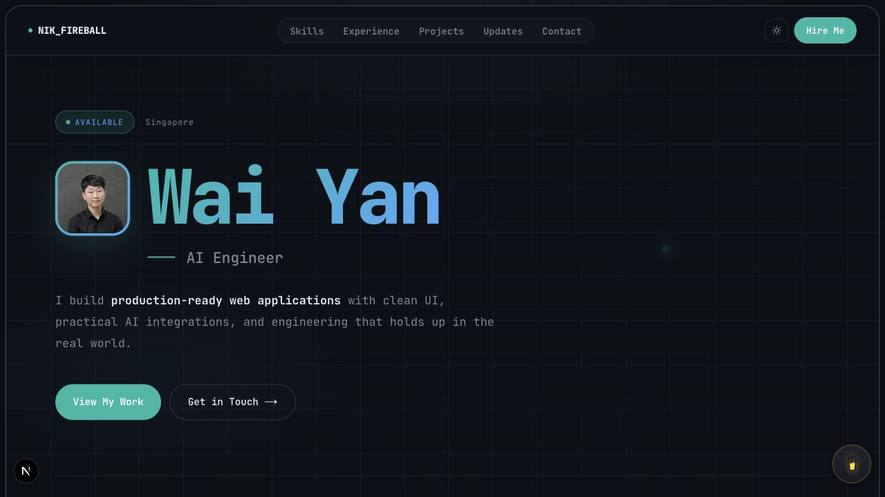

<div align="center">

# Wai Yan Portfolio

AI Engineer portfolio built with Next.js, React, Tailwind CSS, and a clean project-first content system.


</div>

## Preview



## About

This is my personal portfolio for presenting who I am, what I build, and the projects that best represent my work across full-stack development, practical AI, security, and polished product interfaces.

The site is designed to feel more like a real product than a static profile page. It includes a strong homepage, curated skills, experience, project case studies, theme support, and a low-friction contact flow with invisible spam protection.

## Highlights

- Homepage hero with profile photo, availability status, project navigation, and dark visual system.
- Curated skills across programming, web and API work, databases, cloud, AI, ML, tooling, and deployment.
- Project system backed by GitHub data with selected overrides for stronger case studies.
- Project detail pages for portfolio work, e-commerce builds, phishing detection, and Lingo-Man.
- Contact form with honeypot, timing checks, rate limiting, and Nodemailer delivery.
- Dark and light theme support through `next-themes`.

## Tech Stack

| Area | Tools |
| --- | --- |
| Framework | Next.js 15, React 18 |
| Styling | Tailwind CSS, custom global design system |
| UI | Lucide React, Heroicons, reusable app components |
| Data | GitHub API, local portfolio content maps |
| Contact | Next.js API routes, Nodemailer, invisible spam protection |
| Deployment | Vercel-ready Next.js app |

## Featured Projects

- **AI Engineer Portfolio**: this portfolio, with project case studies, theme support, and a protected contact flow.
- **Full E-commerce Project**: e-commerce platform with product listings, cart, checkout, Stripe payments, and admin dashboard.
- **Daily-Hype**: fashion and lifestyle e-commerce storefront deployed on Vercel.
- **Phishing Detection Website**: interactive security-focused phishing detection experience.
- **Lingo-Man**: language-learning web app with a polished product-style UI.

## Getting Started

Install dependencies:

```bash
npm install
```

Run the development server:

```bash
npm run dev
```

Open [http://localhost:3000](http://localhost:3000) in your browser.

## Environment Variables

The portfolio works without mail credentials, but the contact form needs SMTP configuration to send messages.

Common local setup:

```bash
SMTP_HOST=smtp.gmail.com
SMTP_PORT=465
SMTP_USER=your-email@gmail.com
SMTP_PASS=your-app-password
CONTACT_TO_EMAIL=wai71308@gmail.com
```

The API also supports equivalent `EMAIL_*`, `MAIL_*`, and `GMAIL_*` variable names.

## Scripts

```bash
npm run dev      # Start local development
npm run build    # Build for production
npm run start    # Start the production server
npm run lint     # Run Next.js linting
```

## Project Structure

```text
src/app
|-- api/contact          # Contact form and spam-protection API
|-- components           # Shared UI and page components
|-- data                 # Portfolio content, routes, metadata, and project maps
|-- pages                # Homepage sections
|-- projects/[slug]      # Project case study pages
`-- page.js              # Homepage composition
```

## Contact

- GitHub: [CharmTzy](https://github.com/CharmTzy)
- LinkedIn: [linkedin.com/in/wai-yan-1839512a8](https://sg.linkedin.com/in/wai-yan-1839512a8)
- Email: [wai71308@gmail.com](mailto:wai71308@gmail.com)
